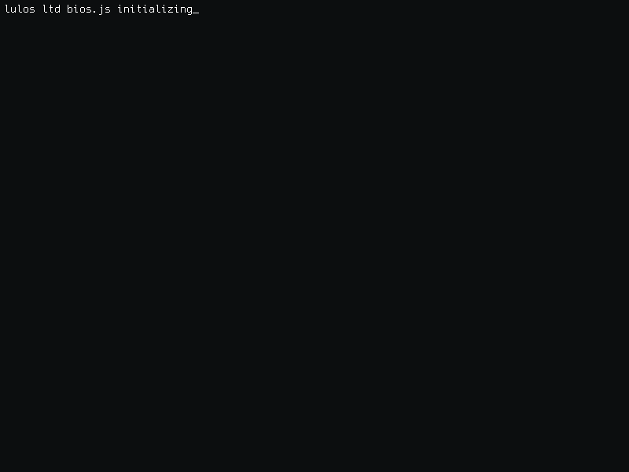

<h2 align="left">Hi 👋! My name is Bryan Campuzano and I'm a Junior DevOps Developer, from Colombia</h2>

###

<picture>
    
</picture>

###

  

###

  
  
  
  
  
  
  
  
  
  
  
  
  
  
  
  
  
  
  
  
  
  
  

###

  

